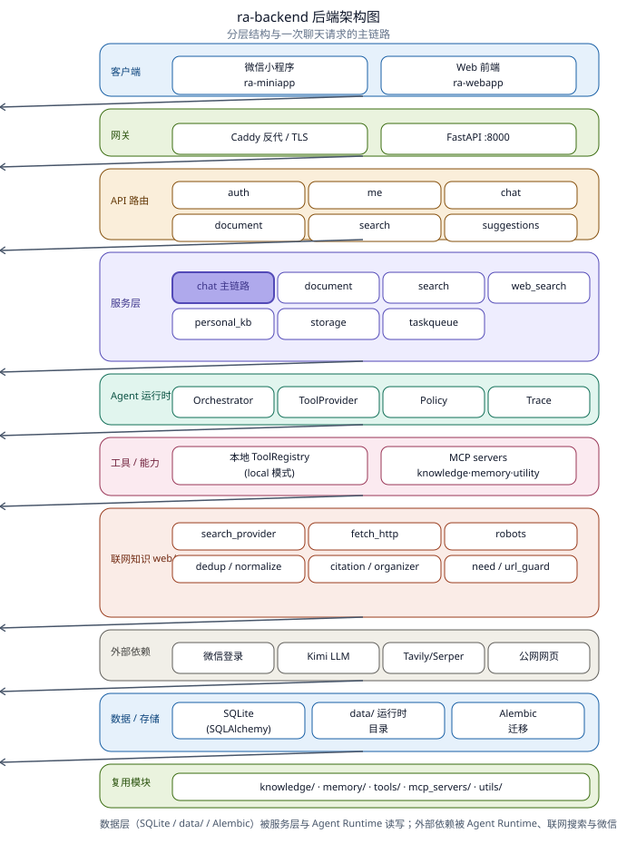

# ra-backend

ReActAgent 的后端服务，面向微信小程序和 Web 前端提供账号、文档知识库、检索、会话和智能问答 API。

## 项目概览

`ra-backend` 是一个 FastAPI 服务，核心能力包括：

- 微信小程序 code 登录，支持 mock 和真实微信 `jscode2session`
- 账号密码注册/登录，用于 Web 端和跨端账号复用
- JWT Bearer Token 鉴权
- 用户资料、头像、每日额度查询和更新
- 小程序用户绑定账号密码
- 会话列表、会话创建、历史消息读取和消息发送
- 文档上传、解析、切分、摘要和用户隔离存储
- 文档搜索、单文档问答和用户知识库问答
- 对话联网与全网知识抓取：支持 tavily/serper 搜索、网页抓取（含 robots.txt 合规）与引用整理，并沉淀为个人知识库
- Agent Runtime 工具调用、引用片段、资源引用和工具轨迹回传
- 本地或 MCP 模式的知识、记忆、工具服务
- Docker Compose + Caddy 部署脚手架

在线服务入口在 `apps/backend/`。仓库中还保留了原有的 `agent/`、`knowledge/`、`memory/`、`tools/` 和 `mcp_servers/` 模块，供线上 Runtime 复用。

## 目录结构

- `apps/backend/`: FastAPI 应用、API 路由、鉴权、数据库、服务层、schemas 和 Agent Runtime
- `apps/backend/api/`: 业务 API 路由，包括 auth、me、chat、document、search、suggestions
- `apps/backend/services/`: 文档、搜索、聊天、联网搜索（`web_search_service`）、个人知识库（`personal_knowledge`）、存储（`storage`）与任务队列（`taskqueue`）业务逻辑
- `apps/backend/web/`: 联网抓取与搜索子模块（fetch/crawl、search provider、robots、citation、dedup、normalize、organizer、need_detector、url_guard）
- `apps/backend/agent_runtime/`: 工具选择、LLM 调用、工具轨迹和资源引用编排
- `apps/backend/mcp/`: MCP server registry、client manager 和异常定义
- `knowledge/`: 文档解析、切分、导入管线和知识库处理逻辑
- `memory/`: Agent memory helper
- `mcp_servers/`: knowledge、memory、utility 三组本地 stdio MCP server
- `scripts/`: 聊天、RAG、微信登录、文档隔离等验证脚本
- `docs/`: 架构设计、知识库导入、MCP 改造和部署方案文档
- `data/`: 默认运行时数据目录，保存 SQLite、上传文件和向量/导出数据

## 后端架构

下图展示 ra-backend 的分层结构与一次聊天请求的主链路：



- 客户端（小程序 / Web）经 Caddy 反向代理进入 FastAPI 应用；
- 路由层按业务域拆为 `auth` / `me` / `chat` / `document` / `search` / `suggestions`；
- 服务层由 `chat_service` 主链路编排文档、检索、联网搜索（`web_search`）、个人知识库（`personal_kb`）、存储（`storage`）与任务队列（`taskqueue`）；
- `AgentOrchestrator` 通过 `ToolProvider` 调用本地工具（`ToolRegistry`）或 MCP server（`knowledge` / `memory` / `utility`）；
- 联网知识子模块 `apps/backend/web/` 负责搜索、抓取、robots 合规、去重与引用整理；
- 外部依赖包括微信登录、Kimi LLM、Tavily/Serper 与公网网页；数据持久化到 SQLite（`data/` 运行时目录），迁移由 Alembic 管理。

## API 总览

默认 API 前缀：`/api/v1`。

鉴权方式：除登录、注册、健康检查和 `/admin` 占位接口外，业务接口需要请求头：

```http
Authorization: Bearer <token>
```

### 基础接口

| Method | Path | 说明 |
| --- | --- | --- |
| `GET` | `/health` | 服务健康检查，返回服务状态 |
| `GET` | `/admin` | 管理后台占位接口，当前返回 scaffold 状态 |

### 认证接口

| Method | Path | Body | 说明 |
| --- | --- | --- | --- |
| `POST` | `/api/v1/auth/wx-login` | `{ "code": "..." }` | 微信 code 登录；`WECHAT_LOGIN_MODE=mock` 时按 code 生成 mock openid |
| `POST` | `/api/v1/auth/password-register` | `{ "username": "...", "password": "..." }` | 注册账号并直接返回 token |
| `POST` | `/api/v1/auth/password-login` | `{ "username": "...", "password": "..." }` | 账号密码登录 |

登录响应：

```json
{
  "token": "jwt-token",
  "user": {
    "id": 1,
    "nickname": "",
    "avatar": "",
    "quota": { "used": 0, "total": 50 },
    "username": "demo",
    "account_bound": true
  }
}
```

### 用户接口

| Method | Path | Body | 说明 |
| --- | --- | --- | --- |
| `GET` | `/api/v1/me/profile` | - | 获取当前用户资料、额度和账号绑定状态 |
| `PUT` | `/api/v1/me/profile` | `{ "nickname": "...", "avatar": "..." }` | 更新昵称和头像 URL |
| `POST` | `/api/v1/me/password` | `{ "username": "...", "password": "..." }` | 给当前用户绑定或更新账号密码 |

### 会话与消息接口

| Method | Path | Body | 说明 |
| --- | --- | --- | --- |
| `GET` | `/api/v1/chat/sessions` | - | 当前用户会话列表，按更新时间倒序 |
| `POST` | `/api/v1/chat/sessions` | `{ "title": "New session" }` | 创建会话 |
| `GET` | `/api/v1/chat/sessions/{session_id}/messages` | - | 读取会话消息 |
| `POST` | `/api/v1/chat/sessions/{session_id}/messages` | `{ "content": "...", "document_id": 1 }` | 发送用户消息并生成助手回复；`document_id` 可为空 |
| `GET` | `/api/v1/chat/thinking/{thinking_id}` | - | 预留的异步思考状态接口，当前固定返回 `not_found` |

消息响应包含：

- `content`: 助手回复正文
- `refs`: 检索引用片段，包含 `document_id`、`title`、`snippet`、`score`
- `tool_traces`: Agent 调用工具的名称、参数、耗时和状态
- `resource_refs`: MCP/工具侧返回的资源引用
- `metadata`: Runtime 元数据，例如 `runtime_mode` 和可用工具数量

### 文档接口

| Method | Path | 参数/表单 | 说明 |
| --- | --- | --- | --- |
| `GET` | `/api/v1/documents` | query: `domain` | 当前用户文档列表；当前后端只接收 `domain` 筛选 |
| `GET` | `/api/v1/documents/{document_id}` | - | 获取单个文档详情 |
| `POST` | `/api/v1/documents` | multipart: `file`, `domain`, `tags`, `title` | 上传并解析文档 |

文档响应字段：

- `id`, `title`, `domain`, `size`, `chunk_count`
- `created_at`, `summary`, `status`, `is_published`

支持上传格式：

- 前端显式开放：`.md`, `.txt`, `.pdf`, `.docx`, `.pptx`, `.xlsx`
- 后端文本扩展：`.md`, `.json`, `.txt`
- 安装 MarkItDown 后，解析器还会注册部分图片、音视频、压缩包和 HTML 扩展；这些格式不一定被当前前端选择器开放
- 旧版 `.doc` 不支持，请先转换为 `.docx`

文档状态：

- `parsing`: 已保存，正在解析
- `ready`: 解析成功，已生成 chunks 和摘要
- `failed`: 解析失败，`summary` 中会保存失败原因

### 搜索与推荐接口

| Method | Path | 参数 | 说明 |
| --- | --- | --- | --- |
| `GET` | `/api/v1/search` | `q`, `top_k`, `domain` | 在当前用户文档 chunks 中检索，返回按分数排序的文档结果 |
| `GET` | `/api/v1/suggestions` | - | 返回首页推荐问题 |

搜索实现当前是轻量级文本检索：优先匹配 chunks，按短语命中和 token 重合计分；无 chunk 命中时回退到文档标题和摘要匹配。

## 本地开发

安装依赖：

```bash
pip install -r requirements.txt
```

准备环境变量：

```bash
cp .env.example .env
```

最小可运行配置：

```env
KIMI_API_KEY=<your-kimi-api-key>
JWT_SECRET=<random-secret>
WECHAT_LOGIN_MODE=mock
AGENT_TOOL_MODE=local
```

启动服务：

```bash
uvicorn apps.backend.main:app --reload
```

健康检查：

```bash
curl http://127.0.0.1:8000/health
```

访问 OpenAPI 文档：

```text
http://127.0.0.1:8000/docs
```

## 配置项

常用环境变量：

| 变量 | 默认值 | 说明 |
| --- | --- | --- |
| `APP_NAME` | `ReActAgent Backend` | FastAPI 服务名称 |
| `DATABASE_URL` | `sqlite:///./data/db.sqlite3` | 数据库连接串 |
| `UPLOAD_DIR` | `./data/uploads` | 上传文件保存目录 |
| `USER_EXPORT_DIR` | `./data/user_exports` | 用户导出目录 |
| `JWT_SECRET` | `change-me` | JWT 签名密钥，部署时必须修改 |
| `DAILY_QUOTA` | `50` | 用户每日额度 |
| `KIMI_API_KEY` | 空 | Moonshot/Kimi API Key |
| `KIMI_BASE_URL` | `https://api.moonshot.cn/v1` | OpenAI-compatible API base URL |
| `KIMI_MODEL` | `moonshot-v1-8k` | 聊天模型 |
| `KIMI_MAX_TOKENS` | `1024` | 单轮最大输出 token |
| `KIMI_MAX_CONTEXT_MESSAGES` | `12` | 注入上下文的最近消息数 |
| `RETRIEVAL_TOP_K` | `4` | 聊天前置检索片段数量 |
| `RETRIEVAL_CHUNK_SIZE` | `600` | 文档切分大小 |
| `RETRIEVAL_CHUNK_OVERLAP` | `120` | 文档切分重叠 |
| `AGENT_TOOL_MODE` | `mcp` | `local` 或 `mcp` |
| `MCP_SERVER_CONFIG_JSON` | 空 | 自定义 MCP server registry JSON |
| `WEB_SEARCH_PROVIDER` | `tavily` | 联网搜索 provider：`tavily` 或 `serper` |
| `WEB_SEARCH_API_KEY` | 空 | 搜索 provider API Key（环境变量注入，不入库） |
| `AGENT_MAX_TOOL_CALLS` | `4` | 单轮最大工具调用次数 |
| `WECHAT_LOGIN_MODE` | `mock` | `mock` 或 `wechat` |
| `WECHAT_APP_ID` | 空 | 微信小程序 AppID |
| `WECHAT_APP_SECRET` | 空 | 微信小程序 AppSecret |
| `WECHAT_API_TIMEOUT_SECONDS` | `10` | 微信接口超时 |

## Agent Runtime 与 MCP

聊天主链路在 `apps/backend/services/chat_service.py` 中：

1. 保存用户消息
2. 按 `document_id` 或用户知识库进行检索
3. 构造历史上下文和初始引用
4. 通过 `AgentOrchestrator` 调用 LLM
5. 根据 `AGENT_TOOL_MODE` 使用本地工具或 MCP 工具
6. 保存助手回复、引用、工具轨迹和元数据

工具模式：

- `AGENT_TOOL_MODE=local`: 使用进程内 `ToolRegistry`
- `AGENT_TOOL_MODE=mcp`: 使用 stdio MCP server registry

默认 MCP server 组：

- `knowledge_server`
- `memory_server`
- `utility_server`

## 验证脚本

常用验证命令：

```bash
python scripts/verify_chat_api.py
python scripts/verify_rag_api.py
python scripts/verify_document_summary.py
python scripts/verify_document_isolation.py
python scripts/verify_phase3_chat_runtime.py
python scripts/verify_wechat_login.py
```

调试知识库和 memory：

```bash
python scripts/debug_knowledge.py --help
python scripts/debug_memory.py --help
```

## Docker 部署

仓库包含：

- `Dockerfile`
- `docker-compose.yml`
- `Caddyfile`

典型流程：

```bash
git clone <repo-url>
cd ra-backend
cp .env.example .env
docker compose up -d --build
```

Compose 中：

- `app` 容器监听 `0.0.0.0:8000`
- 主机只暴露 `127.0.0.1:8000:8000`
- `caddy` 负责对外暴露 `80` 和 `443`
- `./data` 挂载到 `/app/data`，用于持久化 SQLite 和上传文件

## 相关仓库

- `ra-miniapp`: 微信小程序前端
- `ra-webapp`: Web 前端
