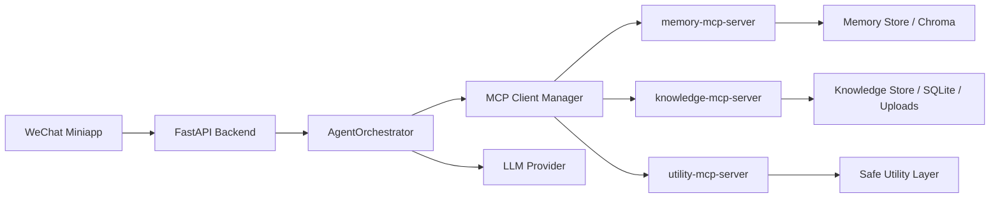
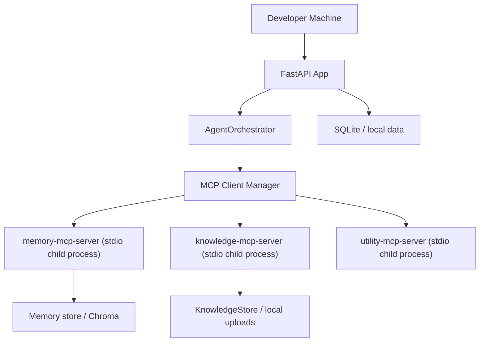
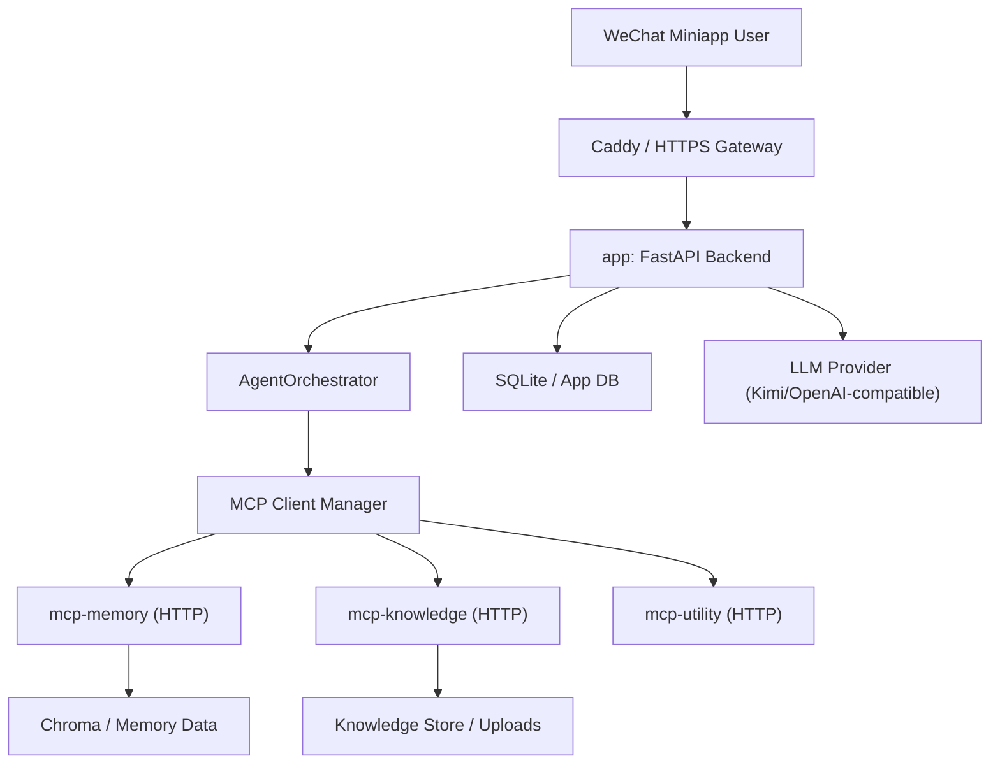
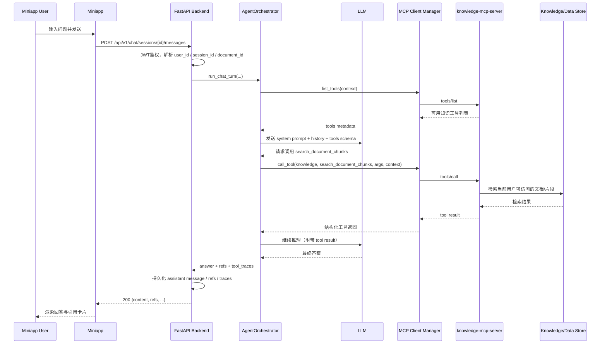

# ReActAgent MCP 工具化改造技术方案

> 文档定位：可直接指导研发拆任务、改代码、联调与上线的执行版方案
> 适用范围：`ra-backend` 后端智能体运行时、现有 `agent/` CLI、线上小程序聊天主链路
> 当前版本：v1.1
> 更新日期：2026-06-23

---

## 1. 结论先行

当前项目确实存在“工具少、工具定义硬编码在 prompt/进程内、不利于扩展”的问题，但更关键的现状是：

1. `agent/react_agent.py` 这条 CLI ReAct 路径和线上小程序主链路不是一套运行时。
2. 当前线上真正服务小程序的是 `apps/backend/services/chat_service.py`，它本质是 `Kimi + 历史消息 + RAG refs`，还没有真正进入可扩展的 Agent Runtime。
3. 因此这次改造不能只改 `agent/` 和 `tools/`，必须同时覆盖线上聊天运行时。

本方案建议：

1. 把 `ra-backend` 设计成 **MCP Host + Agent Runtime 宿主**。
2. 把现有本地 `ToolRegistry` 包装并迁移为若干 **MCP Server**。
3. 新增统一的 **AgentOrchestrator**，让 CLI ReAct 与线上 chat service 共用一套工具发现、调度、权限和日志链路。
4. 分阶段落地，优先保住现有 RAG、用户隔离、微信小程序联调能力，不做“大爆炸重写”。

---

## 2. 当前代码现状与问题

## 2.1 现有两条智能体路径

### 路径 A：CLI ReAct 路径

涉及文件：

- [main.py](D:/Documents/11-p_work/ra-backend/main.py)
- [agent/react_agent.py](D:/Documents/11-p_work/ra-backend/agent/react_agent.py)
- [tools/tools.py](D:/Documents/11-p_work/ra-backend/tools/tools.py)

特征：

1. `react_agent.py` 通过 `REACT_SYSTEM_PROMPT` 把工具说明拼进 prompt。
2. 通过 `_parse_action()` 从模型文本中解析 `Action / Action Input`。
3. 通过 `_execute_tool()` 在本地进程执行工具。

问题：

1. 工具是“代码内注册对象”，不是协议能力。
2. tool schema 没有作为标准接口暴露。
3. 新增工具必须改主仓代码并重启。
4. 无法天然对接 `tools/list` / `tools/call` / `resources/read` / `prompts/get`。

### 路径 B：线上小程序聊天路径

涉及文件：

- [apps/backend/api/chat.py](D:/Documents/11-p_work/ra-backend/apps/backend/api/chat.py)
- [apps/backend/services/chat_service.py](D:/Documents/11-p_work/ra-backend/apps/backend/services/chat_service.py)
- [apps/backend/services/search_service.py](D:/Documents/11-p_work/ra-backend/apps/backend/services/search_service.py)

特征：

1. 当前只用简单 `SYSTEM_PROMPT`。
2. 文档问答依赖 `search_service` 返回 refs。
3. 不会调用 `tools/tools.py` 中定义的工具。
4. 不共享 CLI ReAct 的工具调度能力。

问题：

1. 即使把 `react_agent.py` MCP 化，线上小程序仍然吃不到收益。
2. 线上和 CLI 分裂，会导致后续维护成本持续升高。

## 2.2 当前工具清单

现有工具定义集中在 [tools/tools.py](D:/Documents/11-p_work/ra-backend/tools/tools.py)：

- `calculator`
- `get_current_time`
- `json_format`
- `save_memory`
- `search_memory`
- `search_knowledge`
- `lookup_rule`
- `retrieve_case`
- `save_experience`
- `write_markdown_file`

当前问题不是“工具数量少”这么简单，而是：

1. 工具来源单一，只能是本进程 Python 函数。
2. 工具和主服务强耦合。
3. 工具没有独立部署、监控、权限边界。
4. 线上链路并没有真正消费这些工具。

---

## 3. 改造目标

### 3.1 最终目标

1. 工具、资源、提示词通过 MCP 标准协议暴露。
2. `ra-backend` 通过 MCP Client Manager 统一连接和调用工具。
3. CLI ReAct 和线上聊天共用同一套 Agent Runtime。
4. 用户级隔离、文档权限、日志审计继续保留并增强。
5. 后续新增工具时，优先“新增 MCP Server 或扩现有 MCP Server”，而不是继续改 system prompt。

### 3.2 非目标

1. 本次不要求立刻重写所有业务服务。
2. 本次不要求小程序直接连接 MCP。
3. 本次不要求立刻替换模型供应商。
4. 本次不要求把现有 `search_service.py` / `document_service.py` 推翻重做。

---

## 4. 目标架构

## 4.1 角色划分

### `ra-backend` 主服务

职责：

1. 作为小程序和后台的业务 API 服务。
2. 作为 MCP Host 的宿主。
3. 作为 Agent Runtime 的 orchestrator。
4. 负责用户鉴权、会话状态、工具权限、安全策略、日志审计。

### MCP Server

职责：

1. 暴露 `tools`
2. 视需要暴露 `resources`
3. 视需要暴露 `prompts`

建议第一批拆分为：

1. `memory-mcp-server`
2. `knowledge-mcp-server`
3. `utility-mcp-server`

## 4.2 架构图



## 4.3 部署拓扑

### 4.3.1 开发环境拓扑

开发环境建议先采用“同机不同进程”：



特点：

1. 所有代码仍在一个仓库中开发。
2. 主服务通过 `stdio` 拉起 MCP Server 子进程。
3. 适合本地调试、断点、MCP Inspector 验证。
4. 部署复杂度低，但不适合作为长期线上形态。

### 4.3.2 生产环境拓扑

生产环境建议采用“同仓库、多容器、多服务”：



对应 Docker Compose 角色：

1. `app`
   - 业务 API
   - Agent Runtime
   - MCP Client Manager

2. `mcp-memory`
   - 记忆类 tools/resources

3. `mcp-knowledge`
   - 知识检索 / 文档上下文 / 规则 / 案例类 tools/resources

4. `mcp-utility`
   - 低风险通用工具

5. `caddy`
   - 统一 HTTPS 入口

### 4.3.3 为什么推荐生产环境拆服务

原因：

1. 主服务和工具服务职责边界更清晰。
2. 工具服务可独立扩容、重启、观测。
3. 某个 MCP Server 异常时，不必直接拖垮主 API 服务。
4. 更适合接入健康检查、限流和日志采集。

## 4.3 设计原则

1. **后端做唯一宿主**
   - 小程序只调业务 API，不直接访问 MCP Server。

2. **工具与业务 API 解耦**
   - 工具能力放到 MCP Server，主服务只做 orchestration。

3. **先本地适配，再切主链路**
   - 先用抽象层承接当前 `ToolRegistry`。
   - 再逐步把线上聊天切到 MCP Runtime。

4. **生产优先 HTTP，开发可用 STDIO**
   - 开发调试时用 stdio 简单。
   - 线上部署用 HTTP 更可观测、可伸缩。

## 4.4 请求时序图

下面这张图描述的是一次“用户在小程序里提问，主 Agent 通过 MCP 调知识工具，再返回答案”的标准时序。



### 4.4.1 时序图里的关键点

1. 小程序永远只请求你自己的后端 API，不直接访问 MCP Server。
2. `user_id/session_id/document_id` 由后端传给 MCP 工具，不依赖模型自己描述。
3. 模型只负责“决定是否调用工具、如何组合回答”。
4. 工具真实执行由 MCP Server 完成。
5. 工具返回结果和最终 answer 都应进入持久化和审计链路。

### 4.4.2 文档问答场景的特殊时序

如果用户是从“Ask with this document”进入聊天，则主服务还应在运行时上下文里增加：

1. `document_id`
2. `document_owner_user_id`
3. `document_scope=single`

这意味着：

1. `knowledge-mcp-server` 在执行 `search_document_chunks` 时必须只检索该文档。
2. 如果文档不属于当前用户，应直接返回权限错误，而不是交给模型继续推理。
3. 这样才能延续你当前已经实现的“每个用户只看自己上传文件”的隔离能力。

---

## 5. 推荐目录结构

```text
ra-backend/
├── apps/
│   └── backend/
│       ├── agent_runtime/
│       │   ├── __init__.py
│       │   ├── orchestrator.py
│       │   ├── tool_provider.py
│       │   ├── prompt_builder.py
│       │   ├── policy.py
│       │   ├── trace.py
│       │   └── models.py
│       ├── mcp/
│       │   ├── __init__.py
│       │   ├── client_manager.py
│       │   ├── server_registry.py
│       │   ├── adapters.py
│       │   ├── schemas.py
│       │   └── exceptions.py
│       └── services/
│           └── chat_service.py
├── mcp_servers/
│   ├── memory_server/
│   │   └── server.py
│   ├── knowledge_server/
│   │   └── server.py
│   ├── utility_server/
│   │   └── server.py
│   └── shared/
│       ├── auth_context.py
│       └── result_format.py
└── docs/
    └── MCP工具化改造技术方案.md
```

---

## 6. 研发阶段划分

## 6.1 Phase 0：抽象层落地，不改业务行为

### 目标

在不影响当前线上服务的前提下，先把未来需要的抽象层放进去。

### 必做项

1. 新增 `apps/backend/agent_runtime/tool_provider.py`
2. 定义统一接口：
   - `list_tools()`
   - `call_tool()`
   - `list_resources()`
   - `read_resource()`
   - `list_prompts()`
   - `get_prompt()`
3. 新增：
   - `LocalToolProvider`
   - `MCPToolProvider`
4. 新增 `AgentOrchestrator` 空骨架
5. 让 CLI `ReActAgent` 先能吃 `ToolProvider`

### 推荐改动文件

新增：

- `apps/backend/agent_runtime/tool_provider.py`
- `apps/backend/agent_runtime/orchestrator.py`
- `apps/backend/mcp/client_manager.py`
- `apps/backend/mcp/server_registry.py`

修改：

- `agent/react_agent.py`

### 验收标准

1. 现有 CLI `main.py` 仍可运行。
2. 默认仍走 `LocalToolProvider`，行为不变。
3. 新增抽象层后，不影响现有小程序线上聊天。

## 6.2 Phase 1：把现有工具包装成 MCP Server

### 目标

不改语义，只改暴露形态，让旧工具先通过 MCP 协议可发现、可调用。

### 拆分建议

#### `memory-mcp-server`

首批 tools：

- `save_memory`
- `search_memory`

首批 resources：

- `memory://stats`
- `memory://user/{user_id}/recent`

#### `knowledge-mcp-server`

首批 tools：

- `search_knowledge`
- `lookup_rule`
- `retrieve_case`
- `save_experience`
- `search_document_chunks`

首批 resources：

- `knowledge://stats`
- `knowledge://document/{document_id}`
- `knowledge://document/{document_id}/summary`

#### `utility-mcp-server`

首批 tools：

- `calculator`
- `get_current_time`
- `json_format`

**暂不建议首批直接开放 `write_markdown_file` 到线上主链路。**

### 推荐改动文件

新增：

- `mcp_servers/memory_server/server.py`
- `mcp_servers/knowledge_server/server.py`
- `mcp_servers/utility_server/server.py`

可保留并复用：

- `tools/tools.py`
- `memory/`
- `knowledge/`

### 验收标准

1. MCP Inspector 能看到对应 server 的 tools/resources。
2. 工具返回结果与当前本地 `ToolRegistry` 基本一致。
3. 任一 server 下线不会直接拖垮主 FastAPI 服务。

## 6.3 Phase 2：CLI ReActAgent 切到 MCP ToolProvider

### 目标

先把 CLI 路径切换成功，验证 MCP Runtime 设计成立。

### 改造点

1. `ReActAgent` 不再直接依赖 `ToolRegistry`。
2. `ReActAgent` 改为依赖 `ToolProvider`。
3. `_build_system_prompt()` 不再拼完整工具描述大段文本。
4. 优先尝试模型原生 tool calling。
5. 保留文本 ReAct fallback。

### 推荐做法

新增模式开关：

- `AGENT_TOOL_MODE=local`
- `AGENT_TOOL_MODE=mcp`

### 验收标准

1. `python main.py "你的问题"` 仍能正常回答。
2. 在 `mcp` 模式下，CLI 工具调用成功。
3. 至少一个知识检索和一个记忆工具能完整跑通。

## 6.4 Phase 3：线上 chat_service 切换到 AgentOrchestrator

### 目标

让小程序主链路真正进入“可扩展 Agent Runtime”。

### 当前调用链

当前：

`api/chat.py -> chat_service.py -> Kimi + refs`

目标：

`api/chat.py -> chat_service.py -> AgentOrchestrator -> MCP Client Manager + LLM`

### 推荐落地方式

在 `chat_service.py` 中增加模式开关：

- `CHAT_RUNTIME_MODE=legacy`
- `CHAT_RUNTIME_MODE=agent`

#### `legacy`

继续走当前 `Kimi + RAG refs` 逻辑。

#### `agent`

走 `AgentOrchestrator`：

1. 从 DB 读取消息历史
2. 从 `document_id` 构造上下文
3. 读取可用 MCP tools/resources/prompts
4. 让模型选择调用
5. 工具结果回写 trace
6. 把最终 answer + refs 持久化

### 推荐改动文件

修改：

- `apps/backend/services/chat_service.py`
- `apps/backend/api/chat.py`

新增：

- `apps/backend/agent_runtime/orchestrator.py`
- `apps/backend/agent_runtime/trace.py`

### 验收标准

1. 小程序聊天仍然能用。
2. 文档总结、知识检索、规则问答至少三类场景能调用 MCP tools。
3. 原有 refs 返回不回退。
4. 用户只能访问自己的文档上下文。

## 6.5 Phase 4：resources / prompts 体系完善

### 目标

减少 prompt 中硬编码逻辑，让资源和模板变成独立可演化能力。

### 建议建设内容

resources：

- `knowledge://stats`
- `knowledge://document/{id}`
- `knowledge://document/{id}/outline`
- `memory://user/{id}/recent`

prompts：

- `document_summary`
- `knowledge_qa`
- `rule_audit`
- `case_reference`

### 验收标准

1. prompt 不再维护工具目录。
2. 不同场景可通过 prompt 模板切换运行策略。
3. 资源读取和工具调用有统一 trace。

---

## 7. 关键代码设计

## 7.1 `ToolProvider` 接口

建议定义：

```python
class ToolProvider:
    async def list_tools(self, context: dict | None = None) -> list[dict]: ...
    async def call_tool(
        self,
        tool_name: str,
        arguments: dict,
        context: dict | None = None,
    ) -> dict: ...
    async def list_resources(self, context: dict | None = None) -> list[dict]: ...
    async def read_resource(self, uri: str, context: dict | None = None) -> dict: ...
    async def list_prompts(self, context: dict | None = None) -> list[dict]: ...
    async def get_prompt(self, name: str, arguments: dict | None = None, context: dict | None = None) -> dict: ...
```

设计目的：

1. `ReActAgent` 不关心工具来源。
2. 线上 `chat_service` 不关心工具来源。
3. 本地工具和 MCP 工具可平滑切换。

## 7.2 `AgentOrchestrator` 职责

建议核心接口：

```python
class AgentOrchestrator:
    async def run_chat_turn(
        self,
        *,
        user_id: int,
        session_id: int,
        query: str,
        document_id: int | None = None,
    ) -> dict:
        ...
```

返回建议：

```python
{
  "answer": "...",
  "refs": [...],
  "tool_traces": [...],
  "resource_refs": [...],
}
```

### `tool_traces` 建议结构

```json
[
  {
    "server": "knowledge",
    "tool": "search_document_chunks",
    "arguments": {"query": "退款政策"},
    "status": "ok",
    "duration_ms": 142
  }
]
```

这样后面：

1. 后台可审计
2. 调试时能知道模型到底调用了什么
3. 可以分析哪些工具高频/低效

## 7.3 `MCPClientManager` 职责

建议支持：

1. 服务器注册与配置加载
2. lazy connect
3. tools/resources/prompts 缓存
4. 调用超时控制
5. 错误归一化
6. 健康检查

建议接口：

```python
class MCPClientManager:
    async def start(self) -> None: ...
    async def stop(self) -> None: ...
    async def list_tools(self, server: str | None = None) -> list[dict]: ...
    async def call_tool(self, server: str, tool: str, arguments: dict, context: dict | None = None) -> dict: ...
    async def read_resource(self, server: str, uri: str, context: dict | None = None) -> dict: ...
    async def get_prompt(self, server: str, name: str, arguments: dict | None = None) -> dict: ...
```

---

## 8. 与现有 RAG 的衔接

这是实际开发中最容易走偏的地方。

### 不建议

把现有 `search_service.py` 推翻重写成新的检索层。

### 建议

先把现有能力包装成 MCP 工具。

#### 第一批包装对象

来自 [search_service.py](D:/Documents/11-p_work/ra-backend/apps/backend/services/search_service.py)：

1. `search_documents`
2. `retrieve_relevant_chunks`

来自 [document_service.py](D:/Documents/11-p_work/ra-backend/apps/backend/services/document_service.py)：

1. `get_document`
2. `list_documents`

### 推荐包装后的 MCP 接口

#### tools

- `search_documents`
- `search_document_chunks`
- `get_document_summary`
- `list_user_documents`

#### resources

- `knowledge://document/{id}`
- `knowledge://document/{id}/summary`
- `knowledge://document/{id}/chunks`

### 这样做的好处

1. 老能力不回退
2. 线上能快速切入 MCP
3. 后续再决定是否升级检索算法或向量存储

---

## 9. 用户隔离与安全

## 9.1 必须显式传递上下文

每次 MCP 调用必须由主服务传入：

- `user_id`
- `session_id`
- `document_id`
- `request_id`
- `role_scope`

不要把这些依赖模型自己描述。

## 9.2 权限模型

建议把工具分三类：

### 只读工具

- 搜索知识
- 查询规则
- 读取文档
- 查看统计

### 用户级写工具

- 保存记忆
- 保存经验
- 生成当前用户可下载文件

### 敏感工具

- 任意文件写入
- 外部系统写操作
- 跨用户读取

敏感工具规则：

1. 默认不向线上主链路暴露。
2. 需要后端策略层 allow。
3. 必须记录审计日志。

## 9.3 `write_markdown_file` 的处理建议

当前这个工具风险较高。

建议改造成：

- `export_markdown_report`

限制：

1. 只能写到 `/app/data/user_exports/{user_id}/`
2. 自动生成文件名
3. 禁止自由输入任意路径

---

## 10. 模型调用策略

## 10.1 短期策略

短期建议：

1. 保留当前模型供应商 Kimi
2. 优先使用模型原生 tool calling
3. 不稳定时退回文本 ReAct fallback

## 10.2 Prompt 策略

当前 prompt 里承担了三件事：

1. 角色设定
2. 工具目录
3. 工具协议

改造后应拆开：

### System Prompt

只保留：

1. 身份
2. 输出风格
3. 工具使用原则
4. 安全约束

### MCP Tool Metadata

通过 `tools/list` 动态获取。

### Prompt Templates

通过 MCP `prompts` 获取：

- `document_summary`
- `rule_check`
- `faq_qa`

这样工具变化时不用每次重写大段 prompt。

---

## 11. 部署建议

## 11.1 开发环境

推荐：

1. MCP Server 先用 `STDIO`
2. 主服务本地直连
3. 用 MCP Inspector 调试工具定义和返回

## 11.2 生产环境

推荐：

1. MCP Server 使用 HTTP Transport
2. 跑在同一 Docker Compose 私有网络
3. 主服务通过内部域名访问

示例：

```yaml
services:
  app:
    ...
  mcp-memory:
    ...
  mcp-knowledge:
    ...
  mcp-utility:
    ...
```

### 原因

1. HTTP 更适合健康检查
2. 更适合日志采集和监控
3. 更适合多实例和后续扩容

---

## 12. 第一阶段开发任务拆解

这一节是给研发直接拆任务用的。

## Sprint A：抽象层

### 任务 A1

新增 `ToolProvider` 抽象

产出文件：

- `apps/backend/agent_runtime/tool_provider.py`

验收：

- 能定义本地 provider 和 mcp provider 的统一接口

### 任务 A2

新增 `AgentOrchestrator` 骨架

产出文件：

- `apps/backend/agent_runtime/orchestrator.py`

验收：

- 能接受 `user_id/session_id/query/document_id`
- 返回统一结构体

### 任务 A3

新增 `MCPClientManager`

产出文件：

- `apps/backend/mcp/client_manager.py`
- `apps/backend/mcp/server_registry.py`

验收：

- 能加载 server 配置
- 能 mock `list_tools/call_tool`

## Sprint B：包装旧工具

### 任务 B1

包装 memory 工具

产出文件：

- `mcp_servers/memory_server/server.py`

验收：

- Inspector 可看到 `save_memory/search_memory`

### 任务 B2

包装 knowledge 工具

产出文件：

- `mcp_servers/knowledge_server/server.py`

验收：

- Inspector 可看到知识检索相关 tools/resources

### 任务 B3

包装 utility 工具

产出文件：

- `mcp_servers/utility_server/server.py`

验收：

- 仅暴露低风险工具

## Sprint C：切 CLI

### 任务 C1

`ReActAgent` 改用 `ToolProvider`

修改文件：

- `agent/react_agent.py`

验收：

- CLI 模式仍然可用

### 任务 C2

加入配置开关

修改文件：

- `config.py`
- `.env.example`

验收：

- 可在 local / mcp provider 间切换

## Sprint D：切线上主链路

### 任务 D1

`chat_service.py` 增加 runtime 开关

修改文件：

- `apps/backend/services/chat_service.py`

验收：

- `legacy` 模式保持现状
- `agent` 模式可调用 orchestrator

### 任务 D2

把工具 trace 写回 message 元数据

修改文件：

- `apps/backend/schemas.py`
- `apps/backend/models.py`
- `apps/backend/services/chat_service.py`

验收：

- 后台可看到本轮调用过哪些工具

---

## 13. 验收标准

## 13.1 阶段验收

### Phase 0 完成标准

1. 新抽象层进仓
2. 旧逻辑不回退
3. CLI 仍可运行

### Phase 1 完成标准

1. 三类 MCP Server 都能被 Inspector 发现
2. 核心工具可调用
3. 结果格式稳定

### Phase 2 完成标准

1. CLI ReAct 能走 MCP provider
2. 至少 3 个工具可完整调用

### Phase 3 完成标准

1. 小程序线上聊天可用
2. 文档问答不回退
3. 用户隔离不回退
4. tool traces 可审计

## 13.2 回归清单

每次切换后至少回归：

1. 微信登录仍正常
2. 文档上传仍正常
3. 文档列表只显示当前用户文件
4. `Ask with this document` 仍能总结
5. 普通聊天仍可回答
6. MCP 服务异常时主服务能降级

---

## 14. 风险与应对

### 风险 1：线上路径和 CLI 路径继续分裂

应对：

- 强制统一到 `AgentOrchestrator + ToolProvider`

### 风险 2：MCP 工具数量增长导致响应慢

应对：

1. 工具白名单
2. 按场景筛选 tools
3. tools/list 结果缓存

### 风险 3：文件/写操作权限失控

应对：

1. 默认不暴露危险写工具
2. 必须由后端策略层加白
3. 记录审计日志

### 风险 4：模型原生 tool calling 不稳定

应对：

1. 保留文本 ReAct fallback
2. 先在 CLI 验证，再切线上

---

## 15. 推荐决策

如果只允许做一轮“成本最低但收益最大”的改造，推荐优先做：

1. 落 `ToolProvider` 抽象
2. 落 `MCPClientManager`
3. 落 `knowledge-mcp-server`
4. 让 `chat_service.py` 支持 `legacy/agent` 双模式

原因：

1. 你的核心价值目前在文档问答和知识检索，不在数学/时间类工具。
2. 先把 knowledge 能力 MCP 化，线上就能最先受益。
3. 双模式切换能避免一次性切换导致线上不可控。

---

## 16. 外部参考

官方 MCP 文档：

1. What is MCP
   - https://modelcontextprotocol.io/docs/getting-started/intro
2. Architecture
   - https://modelcontextprotocol.io/docs/learn/architecture
3. Build a Server
   - https://modelcontextprotocol.io/docs/develop/build-server
4. SDK
   - https://modelcontextprotocol.io/docs/sdk
5. Inspector
   - https://modelcontextprotocol.io/docs/tools/inspector

---

## 17. 本文档如何使用

这份文档不是“读完就结束”的说明文，而是开发过程中的执行基线。

建议实际用法：

1. 先按第 12 节拆 Sprint 和任务。
2. 每完成一个 Phase，就按第 13 节做验收。
3. 如果目录结构、模块边界、运行时职责发生变化，必须同步更新本文档。

后续如果你要继续推进，我建议直接按这个顺序开工：

1. 先做 Phase 0
2. 再做 `knowledge-mcp-server`
3. 最后再切 `chat_service.py`
